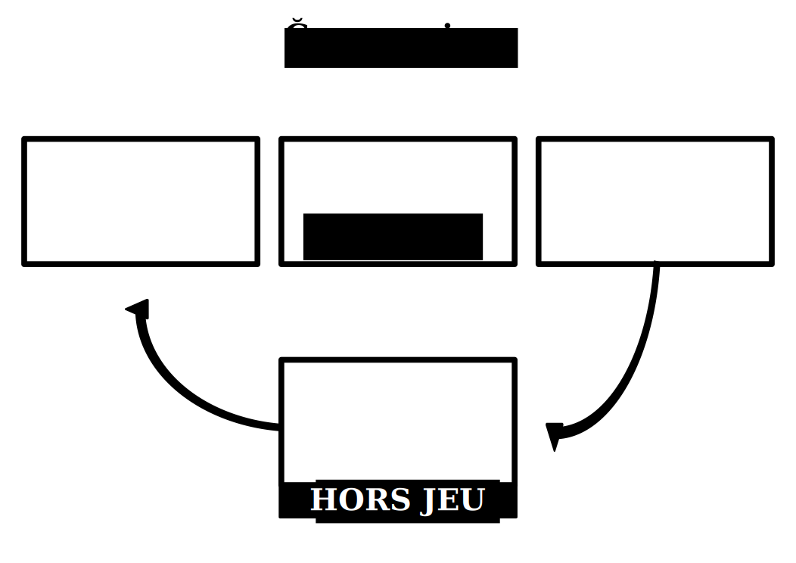

.. Geconomicus documentation master file, created by
   sphinx-quickstart on Fri Feb  5 20:26:00 2016.
   You can adapt this file completely to your liking, but it should at least
   contain the root `toctree` directive.

=========================
Règles du jeu Ğeconomicus
=========================

Introduction
------------

Ğeconomicus est un jeu de simulation économique permettant de découvrir l'influence de la nature de la monnaie sur les échanges.
Les joueurs y achètent et vendent des valeurs économiques dans le but d'en créer de nouvelles.
Le temps est un facteur important du jeu, à plusieurs niveaux, notamment par le cycle de vie des humains et l'obsolescence des valeurs.

L'intérêt du jeu est surtout de comparer différents types de monnaies, dont le concept de monnaie libre, tel que défini dans `La Théorie Relative de la Monnaie
<http://trm.creationmonetaire.info>`_.

Nombre de joueurs
-----------------

10 joueurs ou plus.

Durée
-----

1h30

::

   Temps approximatif pour une partie complète de 10 tours avec un seul type de monnaie

Matériel
--------

* 4 paquets de 52 cartes Valeurs
* 20 billets rouges
* 20 billets verts
* 20 billets bleus
* 20 billets jaunes
* 4 marqueurs valeurs
* 4 marqueurs billets
* Feuille d'aide pour le cycle des valeurs
* Feuille d'aide pour le cycle des billets

::

   Matériel pour dix joueurs.

Cartes Valeurs
--------------

Les cartes valeurs représentent les valeurs économiques échangeables.

Elle sont constituées de 4 paquets de cartes à dos différents.

Chaque paquet contient 13 séries de 4 cartes identiques, soit 52 cartes.

On peut jouer avec des jeux de cartes classiques, mais il est plus pratique d'utiliser les cartes Ğéconomicus.

::

   Pour plus de joueurs, prévoir au moins cinq fois le nombre de joueurs en cartes Valeurs.
   Arrondissez au multiple de quatre supérieur.

Billets de la monnaie
---------------------

La monnaie est constituée de 60 billets colorés.

Il faut 4 couleurs de 20 billets chacune.

On peut jouer avec de simples papiers colorés, mais il est plus pratique d'utiliser les billets Ğéconomicus.

::

   Pour plus de joueurs, prévoir au moins deux fois le nombre de joueurs par couleur.

.. figure:: _static/money/red_banknote.svg
    :align: center
    :width: 40%

    *Billet rouge*

.. figure:: _static/money/green_banknote.svg
    :align: center
    :width: 40%

    *Billet vert*

.. figure:: _static/money/blue_banknote.svg
    :align: center
    :width: 40%

    *Billet bleu*

.. figure:: _static/money/yellow_banknote.svg
    :align: center
    :width: 40%

    *Billet jaune*

Feuille d'aides
---------------

Ces feuilles représentent trois cases alignées au-dessus d'une case centrale. Il faut avoir deux feuilles d'aide.

Sur la première feuille, on dispose les 4 marqueurs de valeurs dans les cases.

Sur la seconde feuille, on dispose les 4 marqueurs de billets dans les cases.

    *Feuille d'aide à imprimer*

Marqueurs de valeurs
--------------------

Les marqueurs de valeurs permettent aux joueurs de savoir, à chaque tour, qu'elle est la valeur la plus haute et l'ordre des valeurs.

Au début de chaque tour, on déplace le marqueur de la case centrale dans la case de gauche, en décalant les marqueurs vers la droite.

La marqueur de la case de droite rejoint alors la case centrale.

La valeur "hors jeu" est celle de la case centrale, et la valeur la plus haute, celle de la case de gauche.

::

   Les marqueurs de valeurs doivent chacun représenter le dos d'un paquet de valeurs.
   Arrondissez au multiple de quatre supérieur.

.. figure:: _static/levels/bronze.svg
    :align: center
    :width: 10%

    *Marqueur niveau bronze*

.. figure:: _static/levels/silver.svg
    :align: center
    :width: 10%

    *Marqueur niveau argent*

.. figure:: _static/levels/gold.svg
    :align: center
    :width: 10%

    *Marqueur niveau or*

.. figure:: _static/levels/diamond.svg
    :align: center
    :width: 10%

    *Marqueur niveau diamant*

Marqueurs de billets
--------------------

Les marqueurs de billets permettent aux joueurs de savoir, à chaque tour, qu'elle est le billet le plus haut et l'ordre des billets.

Au début de chaque tour, on déplace le marqueur de la case centrale dans la case de gauche, en décalant les marqueurs vers la droite.

La marqueur de la case de droite rejoint alors la case centrale.

La couleur de billet "hors jeu" est celle de la case centrale, et la couleur de billet la plus haute, celle de la case de gauche.

Pour imprimer les marqueurs de billets, imprimer une planche supplémentaire de billets ou utiliser les billets du chapitre `Billets de la monnaie`_.

.. index en commentaire
  .. toctree::
     :maxdepth: 2
