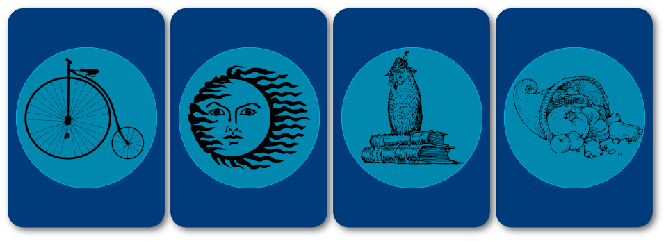
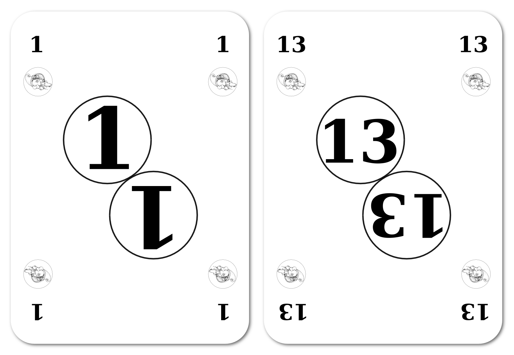

=============
Règles du jeu
=============

Les règles données ici sont pour dix joueurs. Pour plus de joueurs, il faut plus de matériel (voir les chapitres concernés).

Nombre de joueurs
-----------------

10 joueurs ou plus.

::

    +1 animateur
    +1 banquier (pour la monnaie dette)

Durée
-----

1h30

::

   Temps approximatif pour une partie complète de 10 tours avec un seul type de monnaie

Matériel
--------

* 4 paquets de 54 cartes (52 cartes valeurs + 1 carte marqueur + 1 carte notice)
* 1 paquet de valeurs basses (au début cartes rouges Ğeconomicus, ou bien tous les coeurs réunis des 4 paquets).
* 1 paquet de valeurs moyennes (au début cartes jaunes Ğeconomicus, ou bien tous les trèfles réunis des 4 paquets).
* 1 paquet de valeurs hautes (au début cartes vertes Ğeconomicus, ou bien tous les carreaux réunis des 4 paquets).
* 1 paquet de valeurs en attente (au début cartes bleues Ğeconomicus, ou bien tous les piques réunis des 4 paquets).

* 4 paquets de 20 billets
* 20 billets rouges
* 20 billets jaunes
* 20 billets verts
* 20 billets bleus

* 4 billets marqueurs (qui permet de noter le billet de valeur basse en cours)

* Feuille d'aide pour le cycle des valeurs
* Feuille d'aide pour le cycle des billets

* 1 chronomètre

::

   Pour N joueurs, prévoir au moins 5*N en cartes (= au moins 5/4*N carrés). Prévoir au moins 2*N pour chaque couleur de billet.

Cartes valeurs
--------------

Les cartes valeur représentent les valeurs économiques échangeables, elle sont constituées de 4 paquets de cartes différenciés et facilement discernables. Chaque paquet contient 13 séries de 4 cartes identiques, soit au moins 52 cartes formant ainsi 13 carrés.

Style "révolution"
__________________

Le style "révolution" évoque la révolution industrielle du 19ème siècle.

Les quatre niveaux de valeurs sont des gravures évoquant dans l'ordre :

1. L'alimentation : représente les valeurs qui concernent les ressources alimentaires.
2. La culture : représente les valeurs culturelles.
3. L'énergie : représente les valeurs qui concernent les ressources énergétiques.
4. La technologie : représente les valeurs technologiques.

    *Dos des cartes avec les quatre niveaux*

Les valeurs sont représentées par des lettres de **A** à **M**. Cela permet de faciliter les échanges.

    *13 lettres valeurs par niveau*

Billets de la monnaie
---------------------

Il faut 4 couleurs de 20 billets chacune. La monnaie en jeu est constituée de 60 billets colorés.
Et il y a une couleur contituée de 20 billets en attente.

.. figure:: _static/money/red_banknote_modern_preview.png
    :align: center
    :width: 40%

    *Billet rouge*

.. figure:: _static/money/yellow_banknote_modern_preview.png
    :align: center
    :width: 40%

    *Billet jaune*

.. figure:: _static/money/green_banknote_modern_preview.png
    :align: center
    :width: 40%

    *Billet vert*

.. figure:: _static/money/blue_banknote_modern_preview.png
    :align: center
    :width: 40%

    *Billet bleu*

Feuilles d'aide
---------------

Ces feuilles représentent trois cases alignées au-dessus d'une case centrale. Il faut avoir deux feuilles d'aide.

Sur la première feuille, on disposera les 4 marqueurs de valeurs dans les cases.

Sur la seconde feuille, on dispose les 4 marqueurs de billets dans les cases.

.. figure:: _static/help_sheets/help_sheet.svg
    :align: center
    :scale: 100%

    *Feuille d'aide à imprimer*

Marqueurs de valeurs
--------------------

Les marqueurs de valeurs permettent aux joueurs de savoir, à chaque tour, quelle est la valeur la plus haute et l'ordre des valeurs.

La valeur en jeu la plus haute est dans la case de droite.

Dès qu'un joueur a constitué un carré de la plus haute valeur (case de droite), on décale les valeurs d'une case vers la gauche, en suivant le sens des flèches.

Le marqueur de la case du bas ("en attente") est déplacé dans la case de droite, et le marqueur de la case de gauche rejoint la case du bas.

Toutes les cartes valeurs "en attente" sont défaussées par les joueurs et remise dans la pioche correspondante, sans compensation !

.. figure:: _static/cards/revolution/markers.png
    :align: center
    :width: 100%

    *Marqueurs de valeurs*

Marqueurs de billets
--------------------

Les marqueurs de billets permettent aux joueurs de savoir, à chaque tour, quel est le billet le plus haut et l'ordre des billets.

Avant chaque tour, on décale les marqueurs d'une case vers la gauche, en suivant le sens des flêches.

Le marqueur de la case du bas ("en attente") est déplacé dans la case de droite, et le marqueur de la case de gauvche rejoint la case du bas.

Pour imprimer les marqueurs de billets, il faut imprimer une planche supplémentaire de billets ou utiliser les billets du chapitre `Billets de la monnaie`_.

Mise en place
-------------

Sur une table accessible à tous, l'animateur dispose les deux feuilles d'aide et leurs marqueurs.

Sur la première feuille, il dispose les 4 marqueurs de valeurs dans les cases.

De gauche à droite : l'alimentation, la culture, l'énergie.

Valeur "en attente" : la technologie.

.. figure:: _static/help_sheets/help_sheet_markers.png
    :align: center
    :width: 100%

    *Feuille d'aide des valeurs*

Sur la seconde feuille, il dispose les 4 marqueurs de billets dans les cases.

De gauche à droite : le rouge, le jaune, le vert.

Billet en attente : le bleu.

.. figure:: _static/help_sheets/help_sheet_banknotes.png
    :align: center
    :width: 100%

    *Feuille d'aide de la monnaie*

Il mélange le paquet des cartes de la valeur la plus basse (alimentation) et éparpille les cartes faces cachées sur la table.

Il demande alors aux joueurs de piocher chacun 4 cartes au hasard. Ces cartes représentent les valeurs économiques de départ que possèdent les joueurs.

Il prépare aussi deux pioches étalées sur la table avec les deux autres paquets de valeur en jeu (culture et énergie).

But du jeu
----------

Le but du jeu est de créer le plus de valeurs économiques possibles. Pour cela, chaque joueur, doit acheter et vendre des cartes valeur du même paquet, afin de constituer un "carré" de quatre cartes identiques. À chaque "carré" obtenu, le joueur gagne une carte du paquet de la valeur supérieure (voir la feuille d'aide des valeurs).

Il se défausse de son carré dans la pioche du paquet correspondant, et pioche aussi quatre nouvelles cartes de ce même paquet. Ainsi, si sa main était de quatre cartes "alimentation", elle contient maintenant cinq cartes : quatre nouvelles "alimentation" + une "culture".

Avec le roulement des valeurs, les valeurs moyennes valent 2 basses, et les valeurs hautes valent 2 moyennes. Mais lorsqu'un joueur arrive à obtenir un carré de 4 valeurs hautes il crée une "rupture" technologique, la valeur en attente entre en jeu à ce moment là, et les valeurs basses sont retirées du jeu, c'est la valeur moyenne qui devient la nouvelle valeur basse, et on passe ainsi au niveau technologique (ou économique) supérieur.

Règles monétaires
-----------------

L'animateur doit maintenant expliquer aux joueurs les règles qui régissent la monnaie qui est jouée.

.. toctree::
    :maxdepth: 2

    debt_money.rst
    libre_money.rst
    other_money.rst

::

    Il est possible de jouer le troc, sans monnaie, en échangeant une carte contre une carte, mais par expérience, ce système bloque rapidement et ne tient pas 80 ans... Toutefois c'est à vous de le tester et de le comparer avec les autres types de monnaies !

Déroulement de la partie
------------------------

La partie se déroule en 10 tours chronométrés de cinq minutes maximum. On peut réduire à trois minutes si on veut accélérer le jeu.

Chaque tour représente 8 ans. À la fin d'une partie, chaque joueur aura donc vécu 80 ans de jeu, ce qui est l'espérance de vie moyenne en Europe.

Mais attention, la mort rôde et les générations se succèdent...

L'animateur classe les joueurs en dix classes d'âges réparties sur les dix tours. À chaque tour, le (ou les) joueur de la classe d'âge correspondante meurt et revient en jeu en tant que nouveau-né.

Exemples :

 À 20 joueurs, 2 joueurs meurent par tour.

 À 15 joueurs, un ou deux joueurs meurent selon la répartition faîtes sur les dix tours.

Seul l'animateur connaît à l'avance le nom du ou des défunts de chaque tour.

::

    L'ordre des décès est déterminé au début du jeu dans le tableur et doit être gardé secret par l'animateur.

À chaque tour, l'animateur annonce le début du tour et lance le chronomètre. Les joueurs vendent et achètent des cartes valeurs à l'aide des billets de la monnaie en cours. À la fin du tour, les échanges doivent cesser immédiatement. Néanmoins, les personnes ayant constitué un carré avant la fin du chronomètre peuvent l'échanger et gagner ainsi une carte de valeur supérieure.

Fin du tour
-----------

À la fin de chaque tour, l'animateur appelle le ou les joueurs emportés par la mort.

Celui-ci ou ceux-ci s'isolent avec l'animateur, afin que ce dernier comptabilise les valeurs et les billets en possession du joueur.

Le score est enregistré dans la feuille du tableur prévue à cet effet. Dans ce tableur on tient compte à chaque tour de la colonne "TECH" qui permet de savoir à quel niveau de valeur "basse" on se trouve.

Le joueur est ensuite invité à reprendre le jeu comme un nouveau-né.

Il pioche 4 cartes de la valeur la plus basse.

Il reçoit le montant de billets prévu pour les nouveaux arrivants, selon le système monétaire en cours.

Fin de la partie
----------------

À la fin du dernier tour, tous les joueurs sont appelés un par un devant l'animateur. Celui-ci comptabilise les valeurs et billets que possèdent les joueurs et les ajoute dans la feuille du tableur.

Le tableur affiche alors un histogramme complet, permettant de faire le bilan économique du système monétaire qui vient d'être joué.

Compte rendu
------------

Un jeu Ğeconomicus n'est complet que si l'organisateur publie un compte rendu détaillé (billet de blog ou de réseau social, vidéo, diaporama, sur son propre site internet ou un autre lieu), notamment à l'aide des tableurs et graphiques générés que l'on peut remplir directement pendant le jeu par le banquier d'une part, et par celui qui fait la comptabilité des sortants / nouveaux entrants à chaque tour d'autre part.

On devrait ainsi au minimum faire apparaître dans les graphiques pour chaque monnaie jouée :

* Le nombre total de valeurs produites par joueur (banquier inclus pour la « monnaie dette »).
* La moyenne globale des valeurs produites.
* L'écart type de production des valeurs en % de la moyenne.
* La mise à l'échelle comparative des différents types de monnaies jouées.

Pour cela vous pouvez utiliser (ou améliorer) les tableurs au format LibreOffice de Ğeconomicus :

* `Cliquer ici pour télécharger le tableur LibreOffice du compte-rendu <./_static/spreadsheets/geconomicus_money.ods>`_
* `Cliquer ici pour télécharger le tableur LibreOffice du banquier <./_static/spreadsheets/geconomicus_bank.ods>`_
