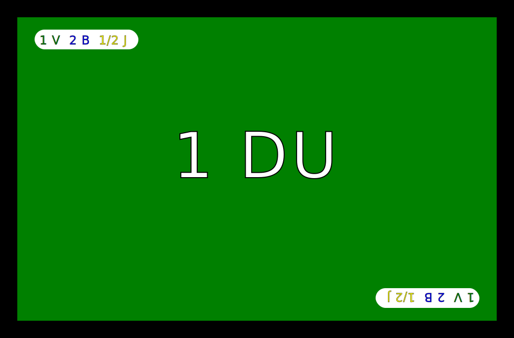
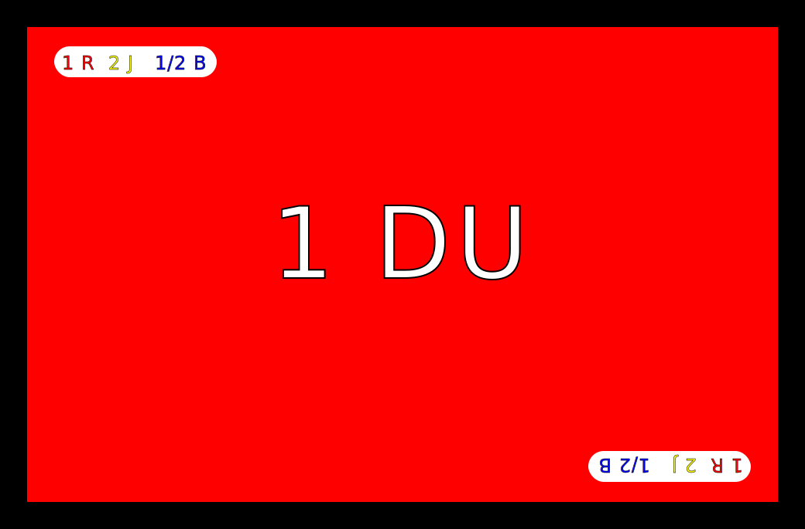
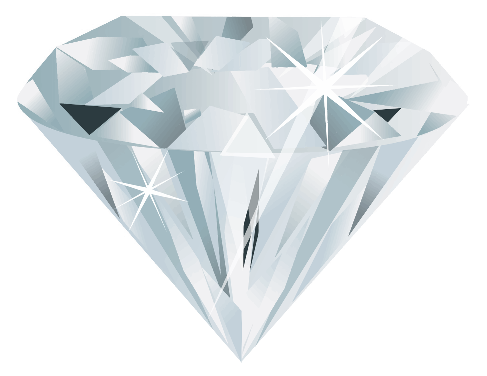
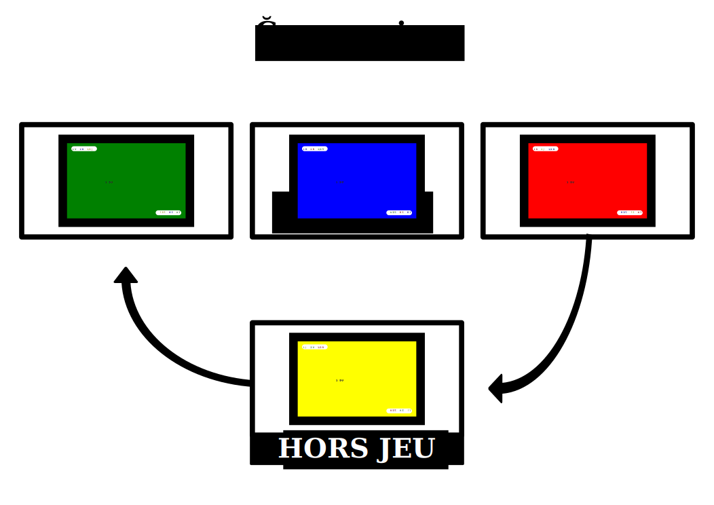

=============
Règles du jeu
=============

Nombre de joueurs
-----------------

10 joueurs ou plus.

::

    +1 animateur
    +1 banquier (pour la monnaie dette)

Durée
-----

1h30

::

   Temps approximatif pour une partie complète de 10 tours avec un seul type de monnaie

Matériel
--------

* 4 paquets de 52 cartes valeur
* 20 billets rouges
* 20 billets verts
* 20 billets bleus
* 20 billets jaunes
* 4 marqueurs valeurs
* 4 marqueurs billets
* Feuille d'aide pour le cycle des valeurs
* Feuille d'aide pour le cycle des billets
* 1 chronomètre

::

   Matériel pour dix joueurs.

Cartes valeur
-------------

Les cartes valeur représentent les valeurs économiques échangeables.

Elle sont constituées de 4 paquets de cartes à dos différents.

Chaque paquet contient 13 séries de 4 cartes identiques, soit 52 cartes.

On peut jouer avec des jeux de cartes classiques, mais il est plus pratique d'utiliser les cartes Ğéconomicus.

::

   Pour plus de joueurs, prévoir au moins cinq fois le nombre de joueurs en cartes Valeurs.
   Arrondissez au multiple de quatre supérieur.

Billets de la monnaie
---------------------

La monnaie est constituée de 60 billets colorés.

Il faut 4 couleurs de 20 billets chacune.

On peut jouer avec de simples papiers colorés, mais il est plus pratique d'utiliser les billets Ğéconomicus.

::

   Pour plus de joueurs, prévoir au moins deux fois le nombre de joueurs par couleur.

    *Billet vert*

.. figure:: _static/money/blue_banknote.svg
    :align: center
    :width: 40%

    *Billet bleu*

    *Billet rouge*

.. figure:: _static/money/yellow_banknote.svg
    :align: center
    :width: 40%

    *Billet jaune*

Feuilles d'aide
---------------

Ces feuilles représentent trois cases alignées au-dessus d'une case centrale. Il faut avoir deux feuilles d'aide.

Sur la première feuille, on disposera les 4 marqueurs de valeurs dans les cases.

Sur la seconde feuille, on dispose les 4 marqueurs de billets dans les cases.

    *Feuille d'aide à imprimer*

Marqueurs de valeurs
--------------------

Les marqueurs de valeurs permettent aux joueurs de savoir, à chaque tour, qu'elle est la valeur la plus haute et l'ordre des valeurs.

La valeur la plus haute est dans la case de gauche.

Dès qu'un joueur a constitué un carré de la plus haute valeur (case de gauche), on décale les valeurs d'une case vers la droite,
en suivant le sens de la flèche.

Le marqueur de la case "hors jeu" est déplacé dans la case de gauche, et le marqueur de la case de droite rejoint la case "hors jeu".

Toutes les cartes valeurs "hors jeu" sont défaussées par les joueurs et remise dans la pioche correspondante, sans compensation !

::

    Les marqueurs de valeurs doivent chacun représenter le dos
    d'un paquet de valeurs.
    C'est à dire les quatre symboles de valeurs (bronze, argent, or, diamant),
    si on utilise les cartes Ğeconomicus.

    *Marqueur niveau bronze*

    *Marqueur niveau argent*

.. figure:: _static/levels/gold.svg
    :align: center
    :width: 10%

    *Marqueur niveau or*

    *Marqueur niveau diamant*

Marqueurs de billets
--------------------

Les marqueurs de billets permettent aux joueurs de savoir, à chaque tour, qu'elle est le billet le plus haut et l'ordre des billets.

Avant chaque tour, on décale les marqueurs d'une case vers la droite, en suivant le sens de la flêche.
La marqueur de la case de droite rejoint alors la case centrale.

Le marqueur de la case "hors jeu" est déplacé dans la case de gauche, et le marqueur de la case de droite rejoint la case "hors jeu".

Pour imprimer les marqueurs de billets, imprimer une planche supplémentaire de billets ou utiliser les billets du chapitre `Billets de la monnaie`_.

Mise en place
-------------

Sur une table accessible à tous, l'animateur dispose les deux feuilles d'aide et leurs marqueurs.

Sur la première feuille, il dispose les 4 marqueurs de valeurs dans les cases.

De gauche à droite : or, argent, bronze.

Valeur "hors jeu" : diamant.

.. figure:: _static/help_sheets/help_sheet_values.svg
    :align: center
    :width: 50%

    *Feuille d'aide des valeurs*

Sur la seconde feuille, il dispose les 4 marqueurs de billets dans les cases.

De gauche à droite : Vert, bleu, rouge.

Billet en attente : les jaunes.

    *Feuille d'aide de la monnaie*

Il mélange le paquet des cartes de la valeur la plus basse (le bronze) et éparpille les cartes faces cachées sur la table.

Il demande alors aux joueurs de piocher chacun 4 cartes au hasard. Ces cartes représentent les valeurs économiques de départ que possèdent les joueurs.

Il prépare aussi deux pioches étalées sur la table avec les deux autres paquets de valeur en jeu (argent et or).

But du jeu
----------

Le but du jeu est de créer le plus de valeurs économiques possibles.

Pour cela, chaque joueur, doit acheter et vendre des cartes valeur du même paquet, afin de constituer un "carré" de quatre cartes identiques.

À chaque "carré" obtenu, le joueur gagne une carte du paquet de la valeur supérieure (voir la feuille d'aide des valeurs).

Pour cela, il défausse son "carré" dans la pioche du paquet correspondant, et pioche quatre nouvelles cartes de ce même paquet.

Ainsi, si sa main était de quatre cartes "bronze", elle contient maintenant cinq cartes, quatre nouvelles "bronze" et une "argent".

::

    Important :
    il est interdit de troquer une carte contre une autre.
    Les joueurs doivent toujours avoir la monnaie suffisante
    pour acheter la carte qu'il désire !

Règles monétaires
-----------------

L'animateur doit maintenant expliquer aux joueurs les règles qui régissent la monnaie qui est jouée.

.. toctree::
    :maxdepth: 2

    debt_money.rst
    libre_money.rst

::

    Il est possible de jouer le troc, sans monnaie,
    en échangeant une carte contre une carte, mais par expérience,
    ce système bloque rapidement et ne tient pas 80 ans…

Déroulement de la partie
------------------------

La partie se déroule en 10 tours chronométrés de cinq minutes maximum. On peut réduire à trois minutes si on veut accélérer le jeu.

Chaque tour représente 8 ans. À la fin d'une partie, chaque joueur aura donc vécu 80 ans, ce qui est l'espérance de vie moyenne en Europe.

Mais attention, la mort rôde et les générations se succèdent…

À chaque tour, un des joueurs doit mourir et rendre toutes ses cartes valeurs et ses billets à l'animateur.

Seul l'animateur connaît à l'avance le nom du défunt de chaque tour.

::

    L'ordre des décès est déterminé au début du jeu dans le tableur
    et doit être gardé secret par l'animateur.

À chaque tour, l'animateur annonce le début du tour et lance le chronomètre.

Les joueurs vendent et achètent des cartes valeurs à l'aide des billets de la monnaie en cours.

À la fin du tour, les échanges doivent cesser immédiatement. Néanmoins, les personnes ayant constitué un carré
avant la fin du chronomètre peuvent l'échanger et gagner une carte de valeur supérieure.

Fin du tour
-----------

À la fin de chaque tour, l'animateur appel le joueur emporté par la mort.

Celui-ci s'isole avec l'animateur, afin que ce dernier comptabilise les valeurs et les billets en possession du joueur.

Le score est enregistré dans la feuille du tableur prévue à cet effet.

Le joueur est ensuite invité à reprendre le jeu comme un nouveau-né.

Il pioche 4 carte de la valeur la plus basse.

Il reçoit le montant de billets prévu pour les nouveaux arrivants, selon le système monétaire en cours.

Fin de la partie
----------------

À la fin du dernier tour, tous les joueurs sont appelés un par un devant l'animateur.
Celui-ci comptabilise les valeurs et billets que possèdent les joueurs et les ajoute dans la feuille du tableur.

Le tableur affiche alors un histogramme complet, permettant de faire le bilan économique du système monétaire qui vient d'être joué.

Compte rendu
------------

Un jeu Ğeconomicus n'est complet que si l'organisateur publie un compte rendu détaillé
(billet de blog ou de réseau social, vidéo, diaporama, sur son propre site internet ou un autre lieu),
notamment à l'aide des tableurs et graphiques générés que l'on peut remplir directement pendant le jeu
par le banquier d'une part, et par celui qui fait la comptabilité des sortants / nouveaux entrants à chaque tour d'autre part.

On devrait ainsi au minimum faire apparaître dans les graphiques pour chaque monnaie jouées :

* Le nombre total de valeurs produites par joueur (banquier inclus pour la « monnaie dette »).
* La moyenne globale des valeurs produites.
* L'écart type de production des valeurs en % de la moyenne.
* La mise à l'échelle comparative des différents types de monnaies jouées.

Utiliser pour cela les tableurs au format LibreOffice de Ğeconomicus :

* `Cliquer ici pour télécharger le tableur LibreOffice du compte-rendu <./_static/spreadsheets/Ğeconomicus_Monnaies.ods>`_
* `Cliquer ici pour télécharger le tableur LibreOffice du banquier <./_static/spreadsheets/Ğeconomicus_Suivi_Banquier.ods>`_
